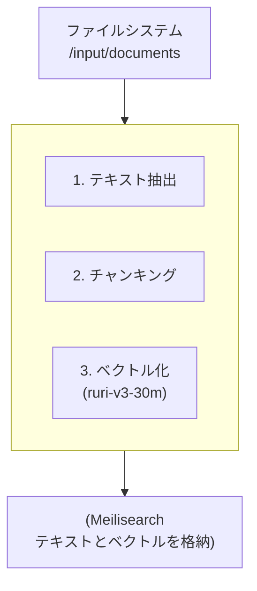
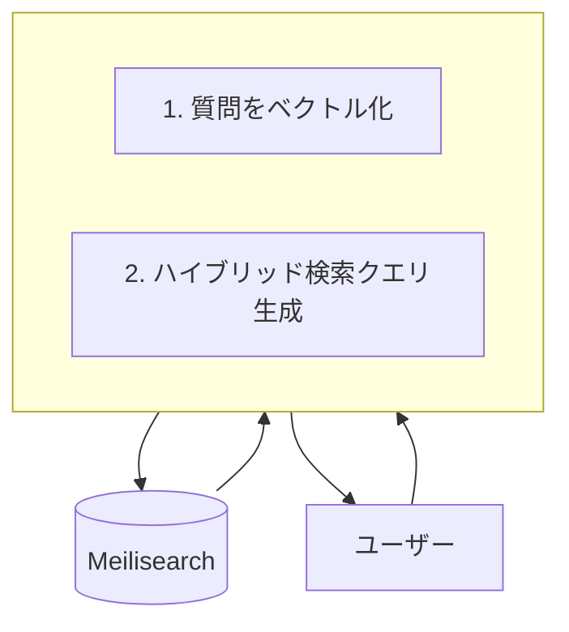

# Meilisearch RAG Server (Japanese Optimized)

Docker Composeで手軽に起動できる、日本語検索とRAG（Retrieval-Augmented Generation）に最適化されたMeilisearch環境です。
指定されたディレクトリ内のドキュメント（PDF, Markdown, テキスト）を自動でチャンキング・ベクトル化し、キーワード検索とベクトル検索を組み合わせた高度なハイブリッド検索APIを提供します。

## ✨ 特徴

- **ハイブリッド検索**: キーワード検索の網羅性とベクトル検索の文脈理解能力を両立。
- **RAG対応アーキテクチャ**: LLMとの連携を前提とし、検索結果をプロンプトに組み込みやすい形式で返却するAPIサーバー (`fastmcp`) を搭載。
- **マルチモーダルなデータ投入**: `pdf`, `md`, `txt`など複数のファイル形式に対応。ファイルを置くだけで自動でデータが前処理され、インデックスに登録されます。
- **日本語特化モデル**: 日本語の文脈理解に優れた`cl-nagoya/ruri-v3-30m`モデルを標準で使用。
- **シンプルな管理**: `docker-compose`で全サービスを一括管理。インデックス設定用のCLIも同梱。
- **テスト駆動開発**: `pytest`によるユニットテストで各コンポーネントの品質を担保。

## 🏗️ アーキテクチャ

### データ投入フロー
`document-ingester`サービスがファイルのテキスト抽出、チャンキング、ベクトル化を行い、Meilisearchに登録します。


### 検索フロー
`fastmcp` APIサーバーがユーザーからの質問を受け取り、ベクトル化してMeilisearchへハイブリッド検索を実行します。


## 🚀 セットアップ & 起動

### 前提条件
- Docker
- Docker Compose

### 手順

1. **リポジトリをクローン**
   ```bash
   git clone <repository_url>
   cd <repository_name>
   ```

2. **環境変数ファイルを作成**
   `MEILI_MASTER_KEY`にユニークで安全なキーを設定してください。
   ```bash
   cp .env.example .env
   # .envファイル内のMEILI_MASTER_KEYを編集してください
   ```

3. **入力ディレクトリを作成**
   ```bash
   mkdir -p input/documents
   ```

4. **Dockerコンテナを起動**
   ```bash
   sudo docker compose up --build -d
   ```
   **注意:** ビルドには時間がかかります。特に初回は`torch`や`sentence-transformers`のモデルダウンロードに数分〜数十分かかる場合があります。

5. **コンテナの起動確認**
   `meilisearch-jp`と`fastmcp-api`が`healthy`または`running`状態になっていれば成功です。
   ```bash
   sudo docker compose ps
   ```

6. **ベクトル検索の有効化**
   Meilisearchのベクトル検索機能は、起動後にAPIで有効化する必要があります。
   ```bash
   curl -X PATCH 'http://localhost:7700/experimental-features' \
     -H "Authorization: Bearer $(grep MEILI_MASTER_KEY .env | cut -d '=' -f2)" \
     --data-binary '{"vectorStore": true}'
   ```

7. **RAG用インデックスのセットアップ**
   付属の管理スクリプトを使い、ベクトル検索用のインデックス設定を適用します。
   ```bash
   # .envファイルから環境変数を読み込んで実行
   export $(cat .env | xargs) && python manage_index.py setup_rag $INDEX_NAME
   ```
   `$INDEX_NAME`は`.env`ファイルで定義されているインデックス名（デフォルト: `documents`）に置き換えてください。

## 使い方

### 1. データを投入する
サポートされているファイル（`.pdf`, `.md`, `.txt`）を`input/documents/`ディレクトリにコピーしてください。
`document-ingester`サービスが自動でファイルを検知し、処理を開始します。

ログで処理状況を確認できます。
```bash
sudo docker compose logs -f document-ingester
```

### 2. RAG APIで検索する
`fastmcp`サービスが提供する`/rag/search`エンドポイントにリクエストを送信します。

```bash
curl -X POST http://localhost:8000/rag/search \
  -H "Content-Type: application/json" \
  -d '{
    "query": "Meilisearchのベクトル検索について教えてください",
    "top_k": 3
  }'
```

**レスポンス例:**
```json
{
  "results": [
    {
      "content": "Meilisearchのベクトル検索は、テキストの意味的な類似性に基づいて文書を検索する機能です...",
      "source": "meilisearch_docs.pdf",
      "score": 0.91
    },
    {
      "content": "ベクトル検索を有効にするには、experimental-featuresエンドポイントをPATCHリクエストで更新する必要があります...",
      "source": "setup_guide.md",
      "score": 0.85
    }
  ]
}
```

## 🧪 テスト

`pytest`を使用したユニットテストが用意されています。

### 1. 依存関係のインストール
```bash
pip install -r requirements.txt
```

### 2. テストの実行
各コンポーネントのユニットテストを個別に実行できます。これらのテストはDockerを必要としません。
```bash
python -m pytest tests/test_index_manager.py
python -m pytest tests/test_ingester.py
python -m pytest tests/test_fastmcp.py
```
