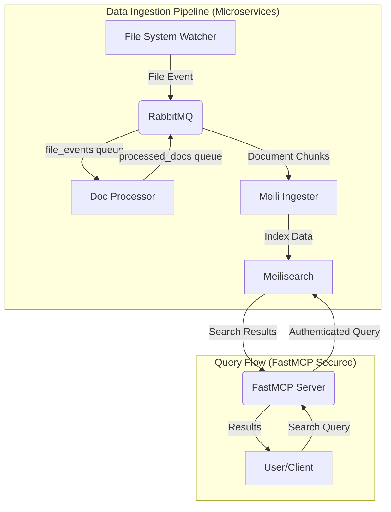

# FastMCP with Meilisearch: A Secure RAG Platform

This project provides a secure and scalable platform for Retrieval Augmented Generation (RAG) using Meilisearch as the core search engine and FastMCP as a secure gateway. It features a microservice-based architecture for robust and efficient data ingestion, including high-fidelity document processing with Docling.

## ✨ Features

- **Secure Query Gateway**: FastMCP acts as a secure entry point for all search queries, providing authentication, authorization, and rate limiting.
- **Microservice Architecture**: A decoupled system using RabbitMQ for asynchronous communication between services, ensuring scalability and resilience.
- **Advanced Document Processing**: The `doc-processor` service uses `docling` for high-fidelity analysis of PDFs, extracting structured content and metadata.
- **Real-time Data Ingestion**: A `file-watcher` service automatically detects new files (PDF, JSON, etc.) in the input directory and triggers the ingestion pipeline.
- **Japanese Language Optimized**: Utilizes a Meilisearch image optimized for Japanese text search.
- **Hybrid Search Ready**: Designed to support Meilisearch's upcoming hybrid search capabilities (keyword + vector).
- **Easy Management**: The entire environment is managed via Docker Compose.

## 🏗️ Architecture

The system is divided into two main pipelines: Data Ingestion and Query Flow.



- **File Watcher**: Monitors the `input/` directory for new files.
- **Doc Processor**: Processes files using `docling` to extract text and structure. It then chunks the document and sends it to the next stage.
- **Meili Ingester**: Receives processed document chunks and ingests them into the Meilisearch `documents` index.
- **FastMCP Server**: Provides a secure REST API for querying Meilisearch. It handles authentication and can enforce authorization rules.
- **Meilisearch**: The core search engine, optimized for Japanese.
- **RabbitMQ**: The message broker that decouples the microservices.

## 🚀 Setup & Launch

### Prerequisites
- Docker
- Docker Compose

### Steps

1.  **Clone the Repository**
    ```bash
    git clone <repository_url>
    cd <repository_name>
    ```

2.  **Create Environment File**
    Set the master key for Meilisearch. **Change `your_strong_master_key_123456` to a unique and secure key.**
    ```bash
    echo "MEILI_MASTER_KEY=your_strong_master_key_123456" > .env
    ```

3.  **Create Necessary Directories**
    ```bash
    mkdir -p input/json input/pdf logs data/meili data/rabbitmq
    touch input/json/.gitkeep input/pdf/.gitkeep
    ```

4.  **Launch Docker Containers**
    ```bash
    docker compose up --build -d
    ```
    Check if all containers are running and healthy:
    ```bash
    docker compose ps
    ```

## 使い方 (Usage)

### 1. Ingesting Data

Place your JSON or PDF files into the respective directories inside `input/`.

-   `input/json/`: for JSON files.
-   `input/pdf/`: for PDF files.

The `file-watcher` service will automatically detect new files and start the ingestion process. You can monitor the logs of each service to see the progress.

```bash
# View logs for all services
docker compose logs -f

# View logs for a specific service
docker compose logs -f file-watcher
docker compose logs -f doc-processor
docker compose logs -f meili-ingester
```

### 2. Searching Data

#### Via Meilisearch UI (Direct Access - for Admin)

You can access the Meilisearch web UI at `http://localhost:7700`. You will need the `MEILI_MASTER_KEY` to log in. This is useful for direct index management and testing.

#### Via FastMCP (Recommended for Clients)

The secure way to query is through the FastMCP server, which runs on `http://localhost:8000`.

Send a POST request to the `/search` endpoint:

```bash
curl -X POST http://localhost:8000/search \
-H "Content-Type: application/json" \
-d '{
    "query": "your search query"
}'
```

*Note: The current FastMCP implementation is a basic proxy. Authentication and other security features are being implemented as per `docs/next_plan.md`.*

### 3. Managing Indices

You can use the `manage_index.py` script to perform administrative tasks on your Meilisearch indices.

```bash
# List all indices
docker compose exec meili-ingester python manage_index.py list

# Create a new index
docker compose exec meili-ingester python manage_index.py create my_new_index

# Delete an index
docker compose exec meili-ingester python manage_index.py delete documents
```

## 🧪 Testing

Run the test suite using `pytest` inside one of the service containers.

```bash
docker compose exec meili-ingester bash -c "PYTHONPATH=. pytest"
```

## ⚙️ Configuration

-   `.env`:
    -   `MEILI_MASTER_KEY`: Master key for Meilisearch.
-   `docker-compose.yml`:
    -   Service ports, volumes, and environment variables.
    -   RabbitMQ credentials (`RABBITMQ_DEFAULT_USER`, `RABBITMQ_DEFAULT_PASS`).
-   `fastmcp/main.py`:
    -   FastMCP server logic and API endpoints.
-   `doc_processor.py`:
    -   Document processing and chunking logic.

Refer to `docs/next_plan.md` for the future direction of this project, including advanced chunking strategies, hybrid search, and full RAG implementation.
