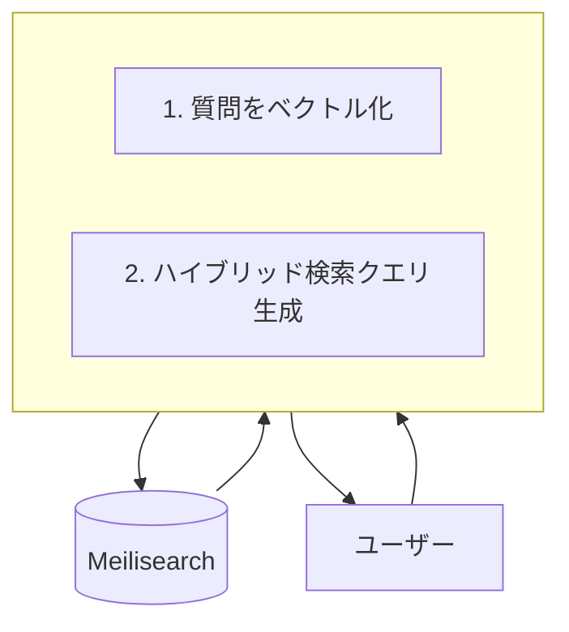

# RAG (Retrieval-Augmented Generation) サーバー実装計画書

## 1. はじめに

本ドキュメントは、既存のMeilisearchベースのドキュメント検索システムに、キーワード検索とベクトル検索を組み合わせたRAG（Retrieval-Augmented Generation）機能を追加実装するための計画を定義するものです。

最終的な目標は、社内ナレッジ検索の精度を向上させ、LLM（大規模言語モデル）との連携を容易にするための検索APIサーバー（`fastmcp`）を構築することです。

## 2. アーキテクチャ

### 2.1. 現行アーキテクチャ

現在のシステムは、指定されたディレクトリに配置されたドキュメント（PDF, JSON）を監視し、ファイル全体を一つのドキュメントとしてMeilisearchに投入する構成です。

```mermaid
graph TD
    A[ファイルシステム<br>/input/pdf, /input/json] --> B{Ingester Service<br>(ingester.py)};
    B --> C[(Meilisearch)];
```

### 2.2. RAG導入後のアーキテクチャ

RAG導入後は、データ投入パイプラインと検索フローが変更されます。

**データ投入フロー:**
`Ingester Service`が、ドキュメントのチャンキング（分割）とベクトル化を行い、ベクトル情報と共にMeilisearchへ登録します。

```mermaid
graph TD
    A[ファイルシステム<br>/input/pdf, md, txt] --> B{Ingester Service<br>(ingester.py)};
    subgraph B [ ]
        B1[1. テキスト抽出]
        B2[2. チャンキング]
        B3[3. ベクトル化<br>(ruri-v3-30m)]
    end
    B --> C[(Meilisearch<br>テキストとベクトルを格納)];
```

**検索フロー:**
新たに`fastmcp` APIサーバーを構築します。ユーザーからの質問は`fastmcp`が受け取り、質問をベクトル化した上でMeilisearchへハイブリッド検索（キーワード＋ベクトル）を実行し、結果を返却します。



---

## 3. コンポーネントごとの変更計画

### 3.1. データ投入パイプラインの拡張 (`ingester.py`)

`ingester.py`を拡張し、RAG用のデータ前処理機能を実装します。

- **対応ドキュメントの追加:**
    - `pdf`, `json`に加え、`md`（Markdown）、`txt`（プレーンテキスト）ファイルを処理対象に追加します。
- **依存ライブラリの追加:**
    - `requirements.txt`に以下を追加します。
        - `sentence-transformers`: テキストのベクトル化のため。
        - `langchain`: テキストのチャンキング（分割）のため。
        - `unstructured` または `pypdf`: PDFやMarkdownからのテキスト抽出を強化するため。
- **処理フローの変更:**
    1.  **テキスト抽出:** 各ファイル形式からプレーンテキストを抽出します。
    2.  **チャンキング:** 抽出したテキストを、`langchain.text_splitter.RecursiveCharacterTextSplitter`等を利用して、意味的なまとまりを維持しつつ適切な長さのチャンクに分割します。
    3.  **ベクトル化:** 各チャンクを`sentence-transformers`と`cl-nagoya/ruri-v3-30m`モデルを用いてベクトル化します。
    4.  **データ登録:** Meilisearchには、チャンクごとに以下の情報を含むJSONドキュメントとして登録します。
        ```json
        {
          "id": "source_file_name_chunk_001",
          "content": "チャンクのテキスト本文...",
          "source": "元のファイル名",
          "chunk_id": 1,
          "_vectors": {
            "default": [0.123, 0.456, ...] // ruri-v3-30mによるベクトル
          }
        }
        ```

### 3.2. Meilisearch設定の変更 (`manage_index.py`)

`manage_index.py`を拡張し、ベクトル検索・ハイブリッド検索用のインデックス設定を自動化する機能を追加します。

- **新コマンドの追加:**
    - `python manage_index.py setup_rag <index_name>` のようなコマンドを新設します。
- **実行する設定:**
    - **Embedder設定:** Meilisearchがベクトルを認識できるように、`userProvided`のEmbedderを設定します。
        ```json
        {
          "embedding": {
            "source": "userProvided",
            "dimensions": 256
          }
        }
        ```
        *`ruri-v3-30m`の出力次元数は256です。*
    - **属性設定:**
        - `searchableAttributes`: `["content"]` を設定し、キーワード検索の対象とします。
        - `filterableAttributes`: `["source"]` を設定し、元のファイル名での絞り込みを可能にします。

### 3.3. RAG検索APIサーバーの新規開発 (`fastmcp`)

ユーザーからの検索リクエストを処理するFastAPIサーバーを新規に開発します。

- **新規サービスの作成:**
    - `fastmcp`ディレクトリをプロジェクトルートに作成します。
    - `fastmcp/main.py`, `fastmcp/Dockerfile`, `fastmcp/requirements.txt` を配置します。
- **依存ライブラリ:**
    - `fastapi`, `uvicorn`, `sentence-transformers`, `meilisearch`, `pydantic`
- **APIエンドポイント:**
    - `POST /rag/search`
    - **リクエストボディ:**
        ```json
        {
          "query": "検索したい質問文",
          "top_k": 3
        }
        ```
    - **レスポンスボディ:**
        ```json
        {
          "results": [
            {
              "content": "関連するドキュメントのチャンク...",
              "source": "元のファイル名",
              "score": 0.89
            },
            ...
          ]
        }
        ```
- **内部処理フロー:**
    1.  サーバー起動時に`cl-nagoya/ruri-v3-30m`モデルをメモリにロードします。
    2.  リクエストで受け取った`query`をロードしたモデルでベクトル化します。
    3.  Meilisearchクライアントを使い、`q`（キーワード）と`vector`（ベクトル）の両方を指定してハイブリッド検索を実行します。
    4.  検索結果を整形し、レスポンスとして返却します。
- **`docker-compose.yml`への追加:**
    - `fastmcp`サービスを`docker-compose.yml`に追加し、Meilisearchサービスに依存するように設定します。ポートは`8000`番を公開します。

---

## 4. 実装ステップの提案

以下のステップで段階的に実装を進めることを提案します。

1.  **Step 1: 環境構築と依存関係の追加**
    - `requirements.txt`に必要なライブラリを追加します。
2.  **Step 2: インデックス設定の拡張**
    - `manage_index.py`を改修し、RAG用のインデックス設定を適用できるようにします。
3.  **Step 3: データ投入パイプラインの改修**
    - `ingester.py`にチャンキングとベクトル化の処理を追加します。
    - 実際にファイルを投入し、Meilisearchにベクトル情報付きのドキュメントが正しく登録されることを確認します。
4.  **Step 4: RAG検索APIサーバーの開発**
    - `fastmcp`サービスを新規に開発し、ハイブリッド検索が正しく機能することを確認します。
5.  **Step 5: 統合とドキュメント化**
    - `docker-compose.yml`に`fastmcp`を追加し、全サービスが連携して動作することを確認します。
    - `README.md`を更新し、新機能の使い方やアーキテクチャについて記載します。

以上
